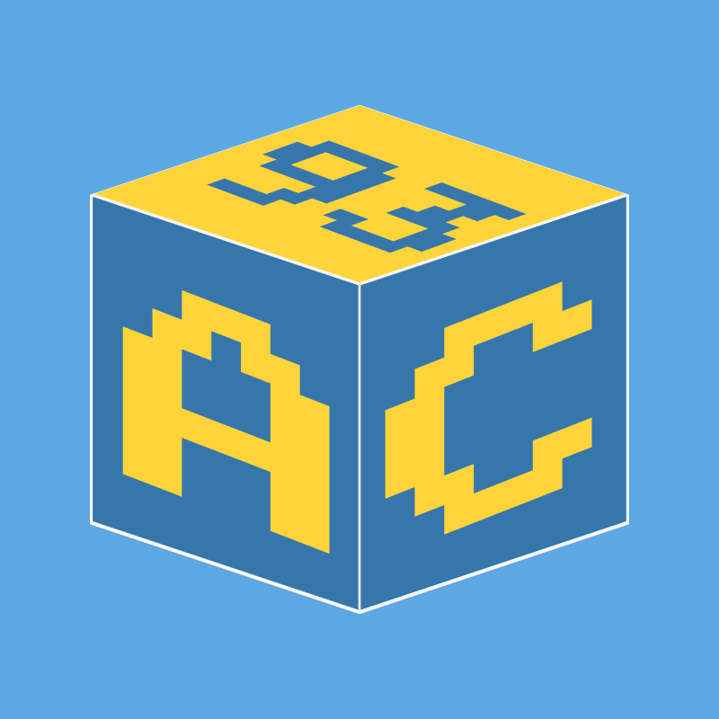

Appcraft Documentation
========================

Welcome to the Appcraft documentation for version |release|!

Appcraft is a modular framework designed to simplify software development by providing a structured and extensible architecture. It enables developers to create and manage complex applications with ease, ensuring scalability and maintainability.

This version includes all the essential features and modules to help you get started with AppCraft.

.. toctree::
   :maxdepth: 2
   :numbered:

   getting_started
   templates/index
   architecture/index
   contributing/index
   contact
   versions/index

Version Information
-----------------------

This documentation corresponds to AppCraft version |release|. For other versions, refer to the `version selection page <../latest/versions/index.html>`_.

Features in Version |release|
--------------------------------

- Easy project creation and setup.
- Initial architecture and structure for new projects.
- Introduction of templates:

   - Base
   - Logs
   - Locales
   - Flask UI
   - Flask API
   - Web Scrapping

For detailed information, explore the sections listed in the `Overview <#overview>`_.
