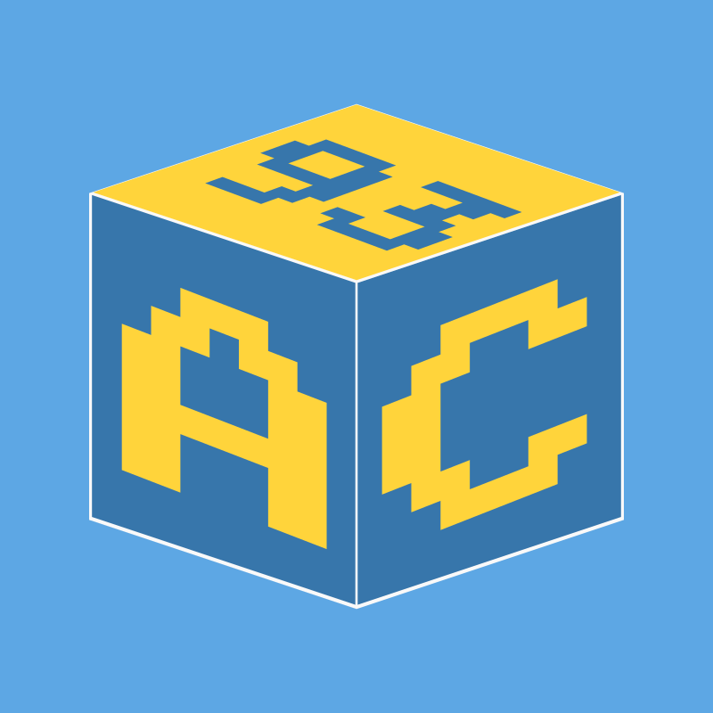

Appcraft Documentation
========================

Welcome to the Appcraft documentation for version |release|!

Appcraft is a modular framework designed to simplify software development by providing a structured and extensible architecture. It enables developers to create and manage complex applications with ease, ensuring scalability and maintainability.

This version includes all the essential features and modules to help you get started with AppCraft.

.. toctree::
   :maxdepth: 2
   :numbered:

   getting_started
   templates/index
   architecture/index
   contributing/index
   changelog
   contact
   versions/index

Version Information
-----------------------

This documentation corresponds to AppCraft version |release|. For other versions, refer to the `version selection page <../latest/versions/index.html>`_.

Available Templates in Version |release|
------------------------------------------

- **Core**: Base, Poetry, Pipenv, uv, Docker, Prompt Toolkit
- **Database**: SQLAlchemy, MongoDB
- **Web**: Flask, Flask API, Flask UI
- **Web Scraping**: Web Scraping (base), Selenium, Playwright, HTTPX, curl_cffi

Git and GitHub are also part of the framework but are currently inactive (hidden from ``list_templates``/``init`` unless ``--install-inactive`` is passed) pending an internal migration — see their pages in the `Templates <templates/index.html>`_ section for details.

For detailed information, explore the sections listed above.
